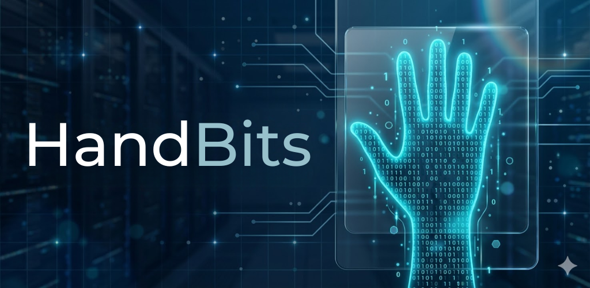

  <h1 align="center">
       HandBits: Aprenda binário com as mãos
    <br />
    <br />
    <a href="https://github.com/StellaKarolinaNunes/HandBits">
     
    </a>
  </h1>

</div>

<p align="center">
  
  
  
  
  <a href="https://github.com/StellaKarolinaNunes/HandBits/blob/main/LICENSE"></a>
</p>

<br>

## Por que HandBits?

O sistema binário é a base da computação moderna, mas seu aprendizado inicial costuma ser abstrato e puramente teórico. Muitos estudantes sentem dificuldade em visualizar como a combinação de bits resulta em valores decimais. O HandBits foi criado para preencher essa lacuna, transformando um conceito lógico em uma experiência física e visual, utilizando algo que todos temos à disposição: as mãos.

## A Solução

A aplicação utiliza visão computacional avançada para converter os cinco dedos de uma mão em cinco bits (variando de 1 a 31 em uma mão, ou mais em versões expandidas). Ao levantar ou abaixar os dedos em frente à webcam, o jogador recebe feedback instantâneo sobre o valor que está representando. Essa abordagem cinestésica acelera a memorização das potências de dois e torna o entendimento de lógica digital natural e intuitivo.

## Funcionalidades Principais

As funcionalidades do projeto foram projetadas para acompanhar a curva de aprendizado do usuário:

*   **Modo Livre:** Permite a exploração sem pressões, onde cada alteração nos dedos reflete imediatamente o valor decimal correspondente na tela.
*   **Modo Tutorial:** Um guia passo a passo que introduz os números de forma sequencial, garantindo que o usuário entenda a progressão dos bits.
*   **Modo Desafio:** Focado em agilidade, onde o sistema gera números aleatórios e o usuário deve representá-los o mais rápido possível, testando sua fluência no sistema binário.
*   **Sistema de Gamificação:** Conquista de medalhas persistentes baseadas em tempo e progresso, incentivando a superação de recordes pessoais.
*   **Feedback Multipataforma:** O software combina indicadores visuais (HUD e partículas) com feedback de voz para confirmar os resultados alcançados.

## Estrutura de Pastas

A organização do projeto segue a Clean Architecture, separando responsabilidades para facilitar a manutenção e escalabilidade:

  ```bash
HandBits/
├── config/                   # Configurações globais
│   ├── __init__.py
│   ├── colors.py             # Paletas de cores e temas
│   ├── medals.py             # Requisitos e dados das medalhas
│   └── settings.py           # Resoluções e configurações fixas
├── core/                     # Núcleo da aplicação
│   ├── __init__.py
│   ├── app.py                # Ponto central de execução
│   ├── events.py             # Gerenciador de eventos (mouse/teclado)
│   └── game_logic.py         # Regras de negócio e estado dos modos
├── audio/                    # Módulo de Som
│   ├── __init__.py
│   └── sound_manager.py      # Integração TTS (voz) e efeitos sonoros
├── tracking/                 # Visão Computacional
│   ├── __init__.py
│   └── hand_detector.py      # Extração de landmarks via MediaPipe
├── ui/                       # Componentes de Interface Gráfica
│   ├── __init__.py
│   ├── dashboard.py          # Gráficos de performance
│   ├── drawing_utils.py      # Utilitários de desenho (retângulos, partículas)
│   ├── game_over.py          # Tela final
│   ├── hand_guide_panel.py   # Guia visual em miniatura
│   ├── hud.py                # Barra de status superior
│   ├── medals_gallery.py     # Vitrine de conquistas
│   ├── popups.py             # Avisos e notificações (toasts)
│   └── top_navigation.py     # Menu superior de abas
├── storage/                  # Persistência de Dados
│   ├── __init__.py
│   └── data_handler.py       # Leitura e salvamento com ofuscação (XOR)
├── utils/                    # Utilitários globais
│   ├── __init__.py
│   └── locales.py            # Sistema de i18n (traduções PT/EN/ES)
├── guia.png                  # Guia visual de mãos para o tutorial
├── save.dat                  # Arquivo binário de progresso persistente
├── main.py                   # Ponto de entrada que inicializa a aplicação
├── requirements.txt          # Lista de dependências Python puras
└── README.md                 # Documentação
```
 
 <br>

 ##  Instalação

### Pré-requisitos para Rodar HandBits na sua máquina

- Sistema Operacional: Linux (Recomendado para o feedback de voz nativo).
- Python: Versão 3.10 ou superior.
- Webcam: Necessária para o rastreamento das mãos via visão computacional.
- Reprodução de Áudio: Necessário ter caixas de som ou fones de ouvido para o feedback sonar.
- Speech Dispatcher (Linux): Para o comando spd-say funcionar, instale via terminal:
sudo apt update && sudo apt install speech-dispatcher

### Tecnologias utilizadas

- Linguagem: Python 3 - Base de toda a lógica do jogo.
- Visão Computacional & Tracking:
- MediaPipe - Framework do Google utilizado para detecção precisa dos 21 pontos das mãos (hand landmarks).
- OpenCV - Usado para capturar vídeo da câmera, processar frames e renderizar toda a interface gráfica (HUD, botões e efeitos).
- Processamento de Dados:
- NumPy - Essencial para o cálculo eficiente das coordenadas espaciais dos dedos.
- Arquitetura/Dev:
- Modularização: Código estruturado em módulos independentes (hand_tracker, visuals, data_handler, etc).
- Git: Utilizado para controle de versão e organização do repositório.

<br>

###  Instalação Rápida

####  1. Clone o repositório

```bash
   git clone https://github.com/StellaKarolinaNunes/HandBits.git
```

####  2. acesse a pasta do projeto

```bash
   cd HandBits
```

####  3. Crie e ative o ambiente virtual

```bash
   python -m venv venv
   source venv/bin/activate
```

####  4. Agora sim, instale as dependências

```bash
   pip install -r requirements.txt
```

### "Compilar" para Executável com PyInstaller

```bash
   pip install pyinstaller
   pyinstaller --onefile --windowed main.py
```

## Roadmap

O desenvolvimento do HandBits está dividido em fases focadas em melhorar a didática e a tecnologia do projeto:

### Fase 1: Fundação e Gamificação (Concluído)
*   [x] Motor de rastreamento de mãos via MediaPipe.
*   [x] Modos Livre, Tutorial e Desafio.
*   [x] Sistema de medalhas e recordes locais persistentes.
*   [x] Feedback de voz em tempo real.

### Fase 2: Expansão Didática (Em breve)
*   [ ] **Modo Operações:** Ensinar somas e subtrações simples usando binários.
*   [ ] **Conversão Reversa:** O sistema mostra um valor binário e o usuário deve dizer o decimal (ou vice-versa).

### Fase 3: Interface e Acessibilidade
*   [ ] **Suporte Multi-Idiomas:** Tradução para Inglês e Espanhol.
*   [ ] **Feedback Sonoro Aprimorado:** Sons distintos para diferentes níveis de acerto/erro.

### Fase 4: Conectividade e Multiplataforma
*   [ ] **Global Leaderboard:** Ranking online para competir com outros usuários.
*   [ ] **HandBits Web:** Portabilidade para rodar diretamente no navegador (WebAssembly).
*   [ ] **Versão Mobile (Flutter):** Aplicativo para smartphones usando a câmera do celular para praticar em qualquer lugar.

<br>

 ##  Contribuição
Contribuições são muito bem-vindas! Siga estes passos:

### Como Contribuir
1. **Fork** este repositório
2. **Clone** seu fork localmente
3. **Crie** uma branch para sua feature: `git checkout -b feature/nova-funcionalidade`
4. **Faça** suas alterações e commits
5. **Teste** suas modificações
6. **Abra** um Pull Request detalhado

<br>

###  Diretrizes

- Código limpo e bem comentado
- Mensagens de commit claras e objetivas
- Teste todas as funcionalidades
- Mantenha a documentação atualizada
- Siga os padrões de código existentes

<br>

##  Licença

Este projeto está licenciado sob a [Licença MIT](LICENSE).

``` bash
MIT License - você pode usar, modificar e distribuir livremente,
mantendo a referência ao repositório original.
```

 <br>

 ## Contato

 Se você tiver dúvidas, sugestões ou quiser saber mais sobre o projeto, entre em contato:

 - **Principais Desenvolvedores:** [Stella Karolina](https://github.com/StellaKarolinaNunes)
 - **Repositório:** [HandBits no GitHub](https://github.com/StellaKarolinaNunes/HandBits)
 - **LinkedIn:** [Stella Karolina Nunes](https://www.linkedin.com/in/stella-karolina/)

 <br>

 ## Créditos

 O **HandBits** é construído com o apoio de tecnologias e comunidades incríveis:

 - **[Python](https://www.python.org/):** Linguagem base para toda a lógica do projeto.
 - **[MediaPipe (Google)](https://google.github.io/mediapipe/):** Tecnologia de ponta para o rastreamento de mãos.
 - **[OpenCV](https://opencv.org/):** Processamento de imagem e renderização da interface.
 - **[NumPy](https://numpy.org/):** Cálculos matemáticos de alta performance.
 - **[Speech Dispatcher](https://devel.freebsoft.org/speechd):** Sistema de voz para feedback acessível.

 <br>

 
### Desenvolvimento Principal

<table>
  <tr>
    <td align="center">
      <a href="https://github.com/StellaKarolinaNunes">
        
        <br />
        <sub><b>Stella Karolina Nunes Peixoto</b></sub>
        <br />
      </a>
    </td>
  </tr>
</table>
